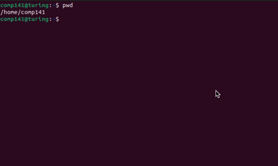

# LUC COMP 141


Loyola University Chicago   
Department of Computer Science    
Course: COMP 141 / 400D - Introduction to Computing Tools and Techniques

-----------
## Overview

COMP 141 is a course offered by the Department of Computer Science at
Loyola University Chicago that introduces the Unix shell environment and tools.
Students who complete it become fluent in the Unix shell as an instrument to
operate computers optimally, helping them to succeed in future academic, research,
and professional computing disciplines and needs.



-------------
## Motivation

Despite the current era of rich graphical user interfaces (desktop, web, and mobile), the "command line" experience
remains important, especially for software developers and computer-aided scientific researchers.
Many development scenarios still require command line and fluency in Unix tools, including the modern embedded,
cloud, cybersecurity, and supercomputing environments. With mobile computing and Internet of Things, Unix (notably via
Linux)
has risen to the level of a ubiquitous platform, owing to its lightweight and open-source nature.
While COMP 141 does not aim at being a comprehensive programming class, students will master basic programming
skills using shell scripting.
They will also learn about problem-solving using Unix commands supported by shell scripts.

-----------
## Delivery

COMP 141 is fully online, with asynchronous lecture videos and reading material,
and weekly online synchronous meetings to let students ask questions and get
content clarification from the instructors.
We use [Sakai](https://sakai.luc.edu/) as the online platform to support,
centralize, and store the course announcements, materials, activities,
assignments, quizzes, progress reports, and grading communication.

----------
## This Branch

This branch of the [original repository](https://github.com/danielmoreira/luc-comp141/tree/main)
is related to *Assignment #5* and shall be cloned by the students to enable
training, evaluation, and answer submission.
The command to clone it is below.

```
git clone -b assignment_5 https://github.com/danielmoreira/luc-comp141.git
```

The starting point of the assignment is the instructions file
available [here](https://github.com/danielmoreira/luc-comp141/blob/assignment_5/assignment_5/instructions.txt).

-------------
## References

* Shots, W. *The Linux Command Line, 2nd Edition*. No Starch Press Book, 2019. Available at https://linuxcommand.org/.
